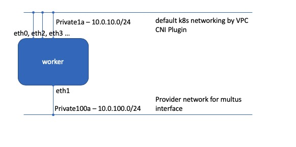

This is the CloudFormation template for self-managed worker node creation with Multus CNI plugin in self-managed ENI mode. This mode is useful when the application wants to have a full ownership for assigning and controlling the IP address to the Pod especially for secondary subnet that is usually exposed to the external network. In this case, default K8s network interface will be still under VPC CNI plugin's control while secondary subnet ENI will be controlled by the application (e.g. IP assignment by Pod or Helm definition). 

## Pre-requisite
- This is applicable when the VPC CNI Plugin has the patch for Multus meta-CNI plugin support. 
https://github.com/aws/amazon-vpc-cni-k8s/pull/866 
- This CFN assumes user already created subnets for Multus interfaces as needed. 
- Current Lambda supports maximum 4 additional multus subnets (besides with a default K8s network). 
- **[Important Note]** *User must be aware of and responsible of that using this CFN and this mode of multus will cause the number of pods hosted on the workernode to be reduced down because this mode is dedicating certain number of ENIs only for Multus subnet purpose. (In general, a number of max Pods on the node has tight dependancy to the number of ENIs available for VPC CNI plugin.)*

## Automation through CloudFormation

From the baseline CFN for self-managed node group, below functions are added;
- LifeCycle Hook creation for the self-managed worker node group (NodeGroup).
- Lambda function creation for ENI attachment of 2ndary subnet (using the code (in zip file) pre-uploaded in S3). Current Lambda can support max 4 multus subnets to be attached. 
- CloudWatch Event Rule to trigger Lambda function. 
- MultusSubnet1/2/3/4 parameters of CFN should be configured properly along with the number of multus subnet desired. 

**Note:** Before running this CloudFormation, you have to place lambda_function zip file (lambda_function.py) to your S3 bucket. 

Before running this CloudFormation, you have to place lambda_function zip file (lambda_function.py) to your S3 bucket. 

During CFN stack creation, 
* Select primary private subnet for the parameter of `Subets: The subnets where workers can be created.` 
* Select 2ndary (Multus) subnet for the parameter of `MultusSubnet1/2/3/4: The subnet where multus ENIs will be connected to.`

After completion of stack creation, update aws-auth-cn.yaml with Node Role ARN in Output section of the CloudFormation result. 

**Update 5/3:** CFN is updated now to take auto-termination of existing workernodes which created before Lambda function kicks in, using Lambda-backed Custom Resource of CFN. 

**Note:** If you use default EKS optimized AMI, since this package doesn't have netutils package, newly added ENI (eth1) doesn't get added to the kernel automatically. So, you have to login workernode and you have to try "sudo ifconfig eth up" once.  

## List of CFNs
Based on required number of multus subnets, user can use different CFNs in this GitHub with same Lambda function.
- amazon-eks-nodegroup-multus-1ENI.yaml : 1 multus subnet
- amazon-eks-nodegroup-multus-2ENIs.yaml : 2 multus subnets
- amazon-eks-nodegroup-multus-4ENIs.yaml : 4 multus subnets

## Release Note 
* 5/3/2020: 
  * Lambda function updated to support Life-cycle hook termination action to clean up orphan ENIs after workernode termination
  * CFN function updated to support auto-termination for instances created before Lambda kicks in. 
  * Different CFNs for each multus subnet case are added.
